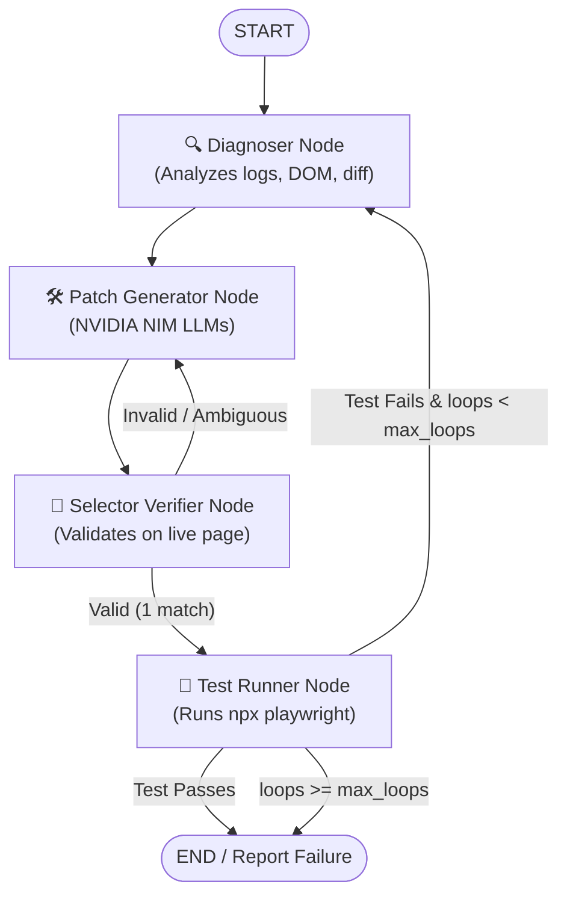
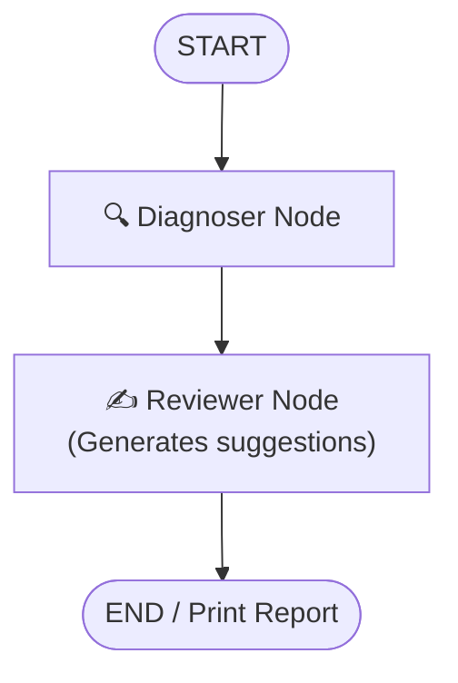

# Technical Architecture & White Paper: E2E-Self-Heal

Welcome to the **E2E-Self-Heal** Technical White Paper. This document provides a deep dive into the architecture, state-machine agent flows, and components that drive the automatic healing of Playwright end-to-end tests.

---

## 🎯 Target Audience & Goals
Playwright is widely adopted across **Frontend (FE) and Quality Assurance (QA) engineering teams**. While the E2E-Self-Heal engine is packaged as a Python library for PyPI distribution, it is built to feel completely native to Node.js/TypeScript developer workflows.

### Core Goals
- **Zero Configuration:** Works seamlessly in any CI pipeline or local workspace with minimal setup.
- **Strict Guardrails:** Only patches locators and wait conditions. It **never** alters test assertions, intent, or business logic.
- **Proactive Verification:** Verifies patched selectors against the live DOM *before* re-running tests, avoiding costly pipeline retries on hallucinated selectors.

---

## 🤖 AI Agent Architecture (Powered by LangGraph)

The self-healing cycle is structured as a state machine using **LangGraph**. This guarantees deterministic step transitions, loop budgets (`max_loops`), and clean separation of concerns.

### 1. Self-Healing Loop Flow
This loop runs when executing `e2e-healer` in standard mode. It detects test failures, generates patches, validates selectors, and re-runs tests.



### 2. Review Mode Flow (Advisory Only)
When run in review mode, the agent remains read-only. It provides diagnostic feedback and suggested source changes without editing files or executing tests.



---

## 🧩 Core Components

### 1. Data Preprocessor
Before sending data to the LLM, raw logs are parsed and condensed:
- **Error Log Parser:** Isolates traceback lines, locator failure messages, and timeout exceptions.
- **Diff AST Analyzer:** Extracts modified source blocks to help the model understand current UI structure changes.

### 2. Selector Verifier
To prevent LLM "hallucinations" (generating selectors that don't match anything or match multiple elements):
- **Live DOM Check:** Compiles and injects a script into the application page (`APP_URL`) to evaluate selectors.
- **Cardinality Check:** Ensures a selector returns **exactly 1 match**. If it returns `0` or `>1` matches, the agent automatically rejects the selector and prompts the Patch Generator to refine it.

### 3. Shadow Testing & Matching Engine
Designed for complex testing where backend network dependencies must be mocked.

- **Request Normalizer (`RequestNormalizer`):** Scrubs dynamic, volatile data (UUIDs, ISO/Epoch timestamps) and removes authentication/security tokens (`Authorization`, `Cookie`, `X-CSRF-Token`) to generate stable request signatures.
- **Match Scorer (`MatchScorer`):** Computes request similarity using configurably weighted metrics:
  ```python
  @dataclass
  class ScoringWeights:
      exact_url_bonus: float = 150.0
      base_url_match: float = 100.0
      query_max: float = 30.0
      headers_max: float = 20.0
      body_max: float = 50.0
  ```
- **Deterministic Resolution:** If multiple candidate mock responses match, they are resolved by:
  1. Score descending
  2. Exact URL match
  3. Exact path match
  4. Sequence index (stable sorting) to guarantee deterministic replays.

---

## 🔒 Security & Sandbox Boundaries
Running AI agents locally or in CI requires tight security boundaries:
- **Strict File Sandboxing:** The agent has read-only access to source files but is restricted to writing **only** to the failing test target.
- **Safe Command Executions:** Subprocesses are locked to a predefined allowlist (e.g., `git diff` and `npx playwright test`).
